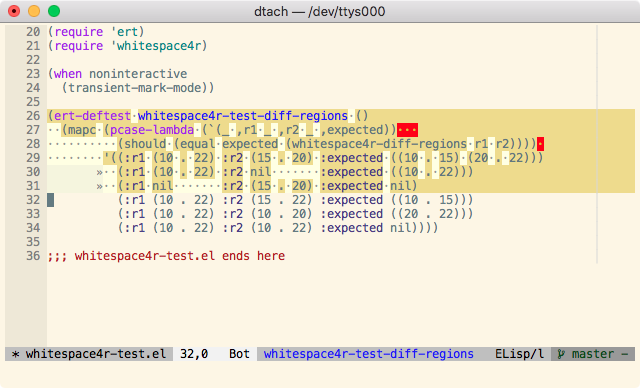
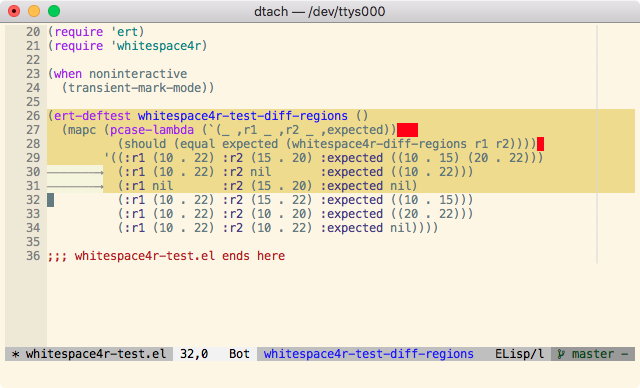

[](https://github.com/twlz0ne/whitespace4r.el/actions?query=workflow%3ACI)

Minor mode to show whitespace for selected region.



## Installation

```elisp
(quelpa '(whitespace4r :fetcher github
                       :repo "twlz0ne/whitespace4r.el"
                       :files ("whitespace4r.el")))
```

## Usage

`M-x whitespace4r-mode`

## Customization

- **whitespace4r-style**

  Specify which kind of blank is visualized.

- **whitespace4r-display-mappings**

  Specify an alist of mappings for displaying characters.

It's a bit annoying to show all the spaces, following is an example of a low interference configuration:

```elisp
(progn
  (setq show-trailing-whitespace nil)
  (setq whitespace4r-style '(tabs hspaces zwspaces trailing))
  (setq whitespace4r-display-mappings `((space-mark      . [?·])
                                        (hard-space-mark . [?¤])
                                        (zero-width-space-mark . [?┆])
                                        (tab-mark        . [?— ?⟶]))))
```


