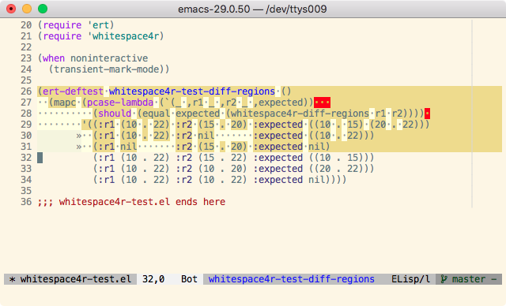

[](https://github.com/twlz0ne/whitespace4r.el/actions?query=workflow%3ACI)

Minor mode to show whitespace for selected region.



## Installation

```elisp
(quelpa '(whitespace4r :fetcher github
                       :repo "twlz0ne/whitespace4r.el"
                       :files ("whitespace4r.el")))
```

## Usage

`M-x whitespace4r-mode`

## Customization

- **whitespace4r-style**

  Specify which kind of blank is visualized.

- **whitespace4r-display-mappings**

  Specify an alist of mappings for displaying characters.
